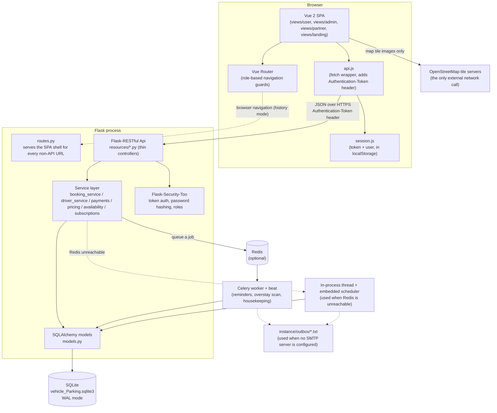
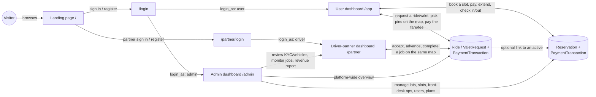
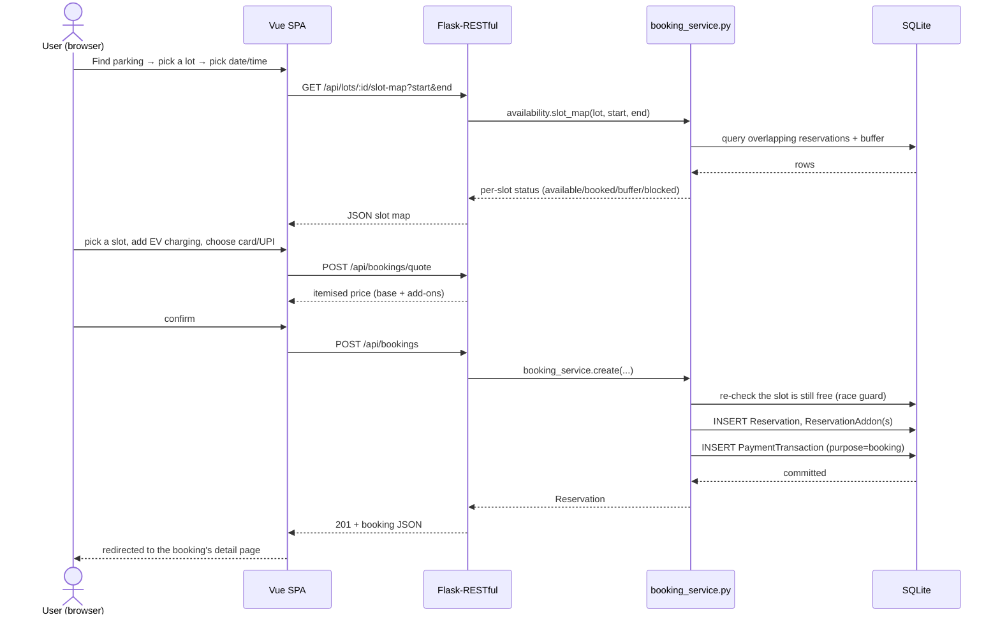
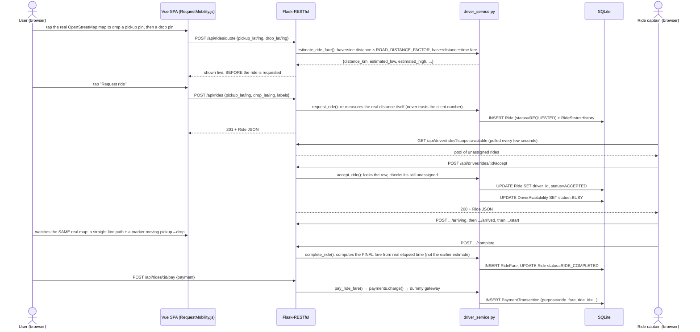
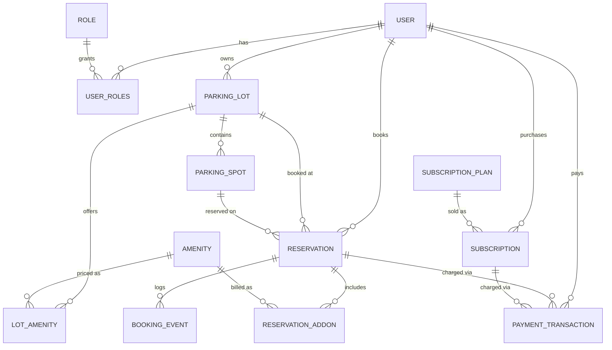
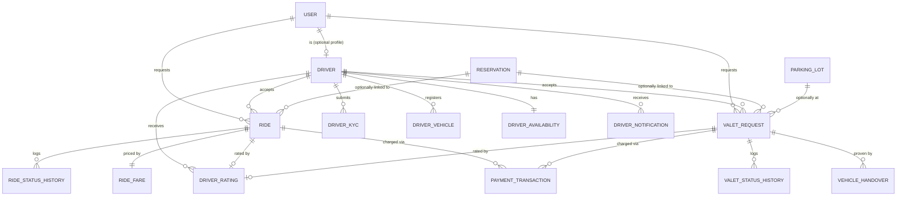

# VParkEasy – Vehicle Parking Management System

VParkEasy is a full-stack parking-lot booking platform with a second domain layered on top of it: an
on-demand **ride captain / valet driver** service. One Flask backend and one Vue 2 single-page app serve
four different front ends from the same codebase and the same database — a public landing page, a parking
customer dashboard, a lot-owner/admin console, and a driver-partner (ride captain / valet driver) dashboard.

This README walks through what's actually implemented: the tech stack, the overall architecture, how each
of the four interfaces is built and how they're wired to one another, the end-to-end workflow for a booking
and for a ride request, and the full database schema with every relationship between tables.

---

## Table of contents

1. [Who uses this app](#1-who-uses-this-app)
2. [Tech stack](#2-tech-stack)
3. [Architecture](#3-architecture)
4. [The four interfaces, and how they interlink](#4-the-four-interfaces-and-how-they-interlink)
5. [End-to-end workflow examples](#5-end-to-end-workflow-examples)
6. [Database schema and relationships](#6-database-schema-and-relationships)
7. [Business rules (enforced server-side)](#7-business-rules-enforced-server-side)
8. [API reference](#8-api-reference)
9. [Quick start](#9-quick-start)
10. [Configuration](#10-configuration)
11. [Background jobs: Redis + Celery](#11-background-jobs-redis--celery)
12. [Tests](#12-tests)
13. [Docker](#13-docker)
14. [Project layout](#14-project-layout)
15. [Troubleshooting](#15-troubleshooting)

---

## 1. Who uses this app

| Who | Sign in at | Then lands on | What they get |
|---|---|---|---|
| **User** (the parking customer) | `/login` → **User** tile | `/app` | Find lots, check amenities, open the **slot map**, book a slot for an exact date/time, add extras (car wash, EV charging …), pay, **extend** the stay, check in/out, pay an **overstay fine**, see every payment, buy a subscription plan, **book a ride or request valet parking** — picking pickup/drop on a real map, with the cost estimated upfront — and track it live, linked to an active booking when there is one |
| **Driver partner** (ride captain **or** valet driver) | `/partner/login` (its own page, separate from `/login`) | `/partner` | Register, submit KYC + (ride captains only) a vehicle, go online, see nearby ride/valet requests and accept one, **navigate to pickup/drop-off on the same real map the rider used**, run the trip or valet job step by step, capture pickup/drop-off handover photos (valet), see earnings, ratings and notifications |
| **Lot owner (admin)** | `/login` → **Lot owner** tile | `/admin` | KPI overview + charts, create/edit/delete lots (rows × bays × levels → slots are generated), live slot board, front-desk operations table (check-in / check-out / collect or waive fines / cancel), users, transactions, plans & billing, **driver-partner directory + KYC/vehicle approval, a platform-wide rides & valet monitor and a driver-partner revenue report**, system status (Redis / Celery / e-mail) |
| **Visitor** | — | `/` | Marketing landing page with live numbers pulled straight from the database, links to sign in/register as either kind of account |

> **Two logins, one account system.** `/login` is for parking customers and lot owners; ride captains and
> valet drivers sign in at the separate `/partner/login`. Both pages post to the exact same `POST /api/login`
> endpoint underneath — the only difference is a `login_as` field (`user` / `admin` / `driver`) and which
> role the returned account is checked against. "User" here is the parking customer role. The underlying
> Flask-Security role name for a driver partner's account is still literally `driver` in the database, but
> every screen's wording says "driver partner" / "ride captain" / "valet driver" instead, so the two never
> look like the same thing to whoever's reading the page.

---

## 2. Tech stack

| Layer | Technology | Why |
|---|---|---|
| Backend framework | **Flask 3** + **Flask-RESTful** | A thin, explicit REST layer (one `Resource` class per endpoint group) on top of a micro-framework — no hidden magic, easy to trace a request from route to response. |
| Auth | **Flask-Security-Too**, token-based (`Authentication-Token` header) | Battle-tested password hashing (PBKDF2-SHA512), role model (`Role`/`UserRoles`) and CSRF handling reused as-is instead of hand-rolling session auth; token auth (not cookies) is a natural fit for a JSON API consumed by a SPA. |
| ORM / database | **SQLAlchemy 2.0** via **Flask-SQLAlchemy**, **SQLite** (WAL mode) | Zero external database service to install for local dev or grading; WAL journal mode + a 15 s busy-timeout let reads keep going while a write is in progress, which matters once the rider and driver-partner sides are both polling the same database. |
| Background jobs | **Celery** + **Redis**, with an **embedded in-process scheduler** fallback | Reminders (booking about to start/end), overstay scans and daily housekeeping run on a real Celery worker when Redis is reachable, or inside the web process on a plain thread when it isn't — the app never *requires* Redis to work. |
| Mail | Flask-Mail, or a **file-based outbox** (`instance/outbox/*.txt`) | No SMTP account needed for local use or grading; every e-mail that would have been sent is still inspectable as a text file. |
| Frontend framework | **Vue 2** (Options API), loaded as a plain `<script>`, **no build step** | Every `.js` view file is an ES module exporting a component object whose `template` is a plain string, run through `Vue.compile()` at runtime. No Webpack/Vite, no `npm run build` — open `index.html`, edit a `.js` file, refresh. |
| Routing | **Vue Router 3**, `history` mode, route-level `import()` code-splitting | Each dashboard's views are only downloaded once the browser actually navigates into that dashboard. |
| Charts | **Chart.js** (UMD build) | KPI graphs on the admin overview/reports pages. |
| Maps | **Leaflet 1.9** + **OpenStreetMap** tiles | The one deliberate exception to an otherwise fully-offline app — see [§3.5](#35-the-one-external-dependency-real-maps). |
| Icons | **Bootstrap Icons** (vendored font + CSS) | Used everywhere via `<i class="bi bi-...">`. |
| Everything above (except map tiles) | Vendored under `static/vendor/` | The whole UI — including Leaflet's own JS/CSS/marker images — is served from this app, not a CDN, so the app keeps working with no internet access at all except for the map tile images themselves. |
| Testing | **pytest**, Flask's own test client, an in-memory SQLite `StaticPool` | Fast (~30s for the full suite), no network, no fixtures on disk. |

---

## 3. Architecture

### 3.1 High-level picture



The backend is a classic **three-layer** design, and the codebase's own docstrings say this explicitly
(`driver_service.py`: *"the REST layer stays thin, this is where every rule lives"*):

1. **`resources/*.py`** — one `flask_restful.Resource` per endpoint group (`bookings.py`, `mobility.py`,
   `driver.py`, `admin.py`, …). A resource method reads the request, calls exactly one service function, and
   serializes the result. It contains no business rules of its own.
2. **`*_service.py` / `pricing.py` / `availability.py` / `payments.py`** — every rule lives here: validation,
   state machines, money maths, conflict detection. This is also what the test suite exercises directly in
   some tests and through the HTTP layer in others, so the same logic is proven twice.
3. **`models.py`** — SQLAlchemy declarative models only; no business logic beyond small derived properties
   (`Reservation.display_status`, `Driver.can_go_online`, …) and a couple of query-building relationships.

`Applications/factory.py`'s `create_app()` wires all of this together: it builds the Flask app, configures
Flask-Security, registers the Flask-RESTful `Api`, initializes SQLAlchemy, starts Celery/the embedded
scheduler depending on whether Redis answers, and — on every boot — runs a **legacy-schema guard**
(`_backup_legacy_sqlite`) that compares every model's columns against what is actually on disk and moves a
stale database aside automatically if a column is missing, rather than crashing on the first request that
touches it.

### 3.2 Frontend architecture

There is no `npm run build`. `templates/index.html` loads Vue, Vue Router, Chart.js and Leaflet as plain
`<script>` tags (global `Vue`/`VueRouter`/`Chart`/`L`), then loads `static/js/main.js` as an ES module —
browsers resolve every `import`/`import()` in the `static/js/` tree natively. Each view is one `.js` file
exporting a plain Vue component object whose `template` field is an ordinary JavaScript template string;
Vue 2's runtime compiler (`Vue.compile`) turns that string into a render function in the browser. This
keeps the edit-refresh loop instant and means the whole frontend is just static files Flask serves.

* **`main.js`** boots the single `new Vue({ el: '#app', router, render: h => h(App) })` instance and installs
  a global 401 handler that bounces back to `/login` whenever a token is rejected.
* **`router.js`** defines every route as a child of one of three role-gated parent routes (`/app`, `/admin`,
  `/partner`) plus the public routes (`/`, `/login`, `/register`, `/partner/login`, `/partner/register`). A
  single `router.beforeEach` guard reads each matched route's `meta.role` and redirects to the right login
  page (or the right dashboard, if the signed-in role doesn't match) — this one guard is the entire access
  control for page navigation; the API is what actually enforces permissions.
* **`session.js`** is a `Vue.observable` holding the current `token`/`user`, persisted to `localStorage` so a
  refresh doesn't sign you out. `isAdmin()`/`isDriver()`/`isPartner()`/`homeFor()` are read everywhere the UI
  needs to branch by role.
* **`api.js`** is the single `fetch()` wrapper every view calls through (`get`/`post`/`put`/`patch`/`del`):
  it attaches the `Authentication-Token` header, turns a non-2xx response into a typed `ApiError` carrying
  the server's own message, and clears the session + fires the 401 handler on an expired token.
* **Shared component libraries per domain** — rather than duplicating a component, each domain keeps one
  shared file that both sides import: `static/js/views/partner/partnerLib.js` defines `JobCard`,
  `PhotoPicker`, the real-map `LocationPickerMap`/`LiveRouteMap` components, and the ride/valet status
  helpers *once*; `static/js/views/user/mobilityLib.js` re-exports all of it for the rider-facing pages. This
  is why the rider and the driver partner always see the same map, the same status labels and the same
  progress logic — there is only one implementation of each, imported twice.
* **"Live" updates are polling, not push.** There is no WebSocket/SSE layer: pages that say "this updates
  automatically" (the pool of available jobs, the admin's live operations table, a job's status) simply
  `setInterval` a re-`GET` of the same endpoint every few seconds. This keeps the whole stack simple (a plain
  request/response API, nothing stateful to reconnect) at the cost of not being instantaneous.

### 3.3 Identity and authorization

There is exactly **one** identity table, `User`, plus a `Role` table and a `user_roles` join table
(Flask-Security's own model, `RoleMixin`/`UserMixin`). A user can hold the `user` role (parking customer),
the `admin` role (lot owner — or, for one specific account configured by `PLATFORM_ADMIN_EMAIL`, the
platform operator), or the `driver` role (driver partner — extended with a one-to-one `Driver` profile row
holding everything role-specific: KYC, vehicle, availability). Nothing about the parking domain and nothing
about the driver-partner domain required a second identity system — a driver partner is a perfectly ordinary
`User` row that happens to also have a `Driver` profile attached.

Every write endpoint re-checks the caller's role and, for anything ID-based (a booking, a ride, a driver
profile), that the record actually belongs to the caller — `resources/base.py`'s `UserResource`/
`AdminResource`/`DriverResource` base classes enforce the role check once, and each service function's
lookup helpers (`get_ride(id, rider=...)`, `require_driver_profile(user)`, …) enforce ownership.

### 3.4 Background jobs

`Applications/config.py`'s `TASK_MODE` (default `auto`) decides, on every job dispatch, whether to push the
job onto Celery/Redis or run it inline on a background thread: at startup the app pings Redis once; if it
answers, reminders/overstay-scans/housekeeping are Celery tasks on the schedule in `CELERY["beat_schedule"]`;
if it doesn't, an embedded scheduler thread inside the web process runs the exact same task functions on the
same cadence. Nothing about a booking, a ride or a valet job ever blocks waiting for Redis — the dispatch
call always returns immediately either way. `GET /api/health` and the admin **System** page both report
which mode is currently active.

### 3.5 The one external dependency: real maps

Every other integration in this app is intentionally dummy: KYC/vehicle documents are approved by a human
admin, not a real verification service; payments run through a local `DummyPaymentGateway` that recognizes a
handful of magic card/UPI values (see [§7](#7-business-rules-enforced-server-side)); fare/fee formulas are a
fixed local calculation. **Real map tiles are the sole exception**, added — as an explicit, discussed
trade-off — so a rider can pick a genuine pickup/drop-off location on a real street map and a driver partner
can see that same real map with a straight-line path overlay. Leaflet itself is vendored locally exactly
like every other frontend library; only the tile *images* are fetched live from the public OpenStreetMap
tile servers, and the map degrades to plain grey squares (everything else keeps working) if that one request
can't reach the internet. There is still no turn-by-turn routing — the overlay is a straight line between two
real coordinates, padded by a configurable `ROAD_DISTANCE_FACTOR` to approximate a road distance, not a real
routing engine's output.

---

## 4. The four interfaces, and how they interlink



### 4.1 Landing page (public, `views/landing/Landing.js`)

A static marketing page that still calls one real endpoint, `GET /api/public/overview`, to show live counts
(lots, bookings, driver partners) pulled straight from the database rather than hard-coded numbers. Its
header and footer are the only two places that link to *both* sign-in pages (`/login` and `/partner/login`),
since which one a new visitor needs is exactly the ambiguity the rest of the app is careful to avoid.

### 4.2 User dashboard (`/app`, parking customer)

Built from `UserLayout.js` (sidebar/topbar shell) plus one view per feature: `FindParking` → `BookingWizard`
(pick date/time → slot map → add-ons → pay) → `MyBookings`/`BookingDetail` (extend, check in/out, cancel, pay
a fine) → `Payments` (transaction history) → `Plans` (subscriptions) → **`Mobility`/`RequestMobility`/
`MobilityDetail`** (the ride-captain/valet-driver request flow: pick pickup/drop on the real map or type
them in, see the upfront fare/fee estimate live as the pins move, submit, then track the job on the same
real map with a straight-line path to the driver partner). A booking's detail page also offers "Need a ride
or valet?", which opens the request form pre-filled with that booking's lot — the one explicit cross-link
between the two domains on this side.

### 4.3 Admin dashboard (`/admin`, lot owner)

Built from `AdminLayout.js` plus: `AdminOverview`/`AdminReports` (KPIs and charts), `AdminLots`/
`AdminSlotBoard` (create a lot, size it in rows × columns × floors — slots are generated and retired
automatically as the layout changes — see a live per-slot board), `AdminOperations` (front-desk table:
check a customer in/out, collect or waive a fine, cancel a booking), `AdminUsers`/`AdminTransactions`/
`AdminPlans` (accounts, payment history, subscription plan editor), `AdminSystem` (Redis/Celery/mail status).
Three more items sit next to these, all **new, driver-partner-facing**, and visible to any lot admin for
read access: `AdminDrivers`/`AdminDriverDetail` (the driver-partner directory + KYC/vehicle review),
`AdminMobility` (a platform-wide table of every ride/valet job, whoever's lot it's linked to or not), and
`AdminDriverRevenue` (platform commission vs. driver-partner payout, aggregated). KYC/vehicle *decisions*
and the revenue report are restricted to the one account configured as `PLATFORM_ADMIN_EMAIL` — any other
lot admin can see the directory but gets a 403 on those specific actions, enforced in
`driver_service.py`/`resources/admin.py`, not just hidden in the UI.

### 4.4 Driver-partner dashboard (`/partner`, ride captain / valet driver)

Built from `PartnerLayout.js` plus: `PartnerKyc`/`PartnerVehicle` (submit documents, wait for admin
approval), an online/offline toggle gated by `Driver.can_go_online` (KYC approved, and — ride captains only —
an approved vehicle), `PartnerJobs`/`PartnerJobDetail` (see the pool of unassigned jobs matching your driver
type, accept one, advance it step by step, capture handover photos for a valet job, see the **same real map**
the rider used with a straight-line path to pickup/drop and a marker that moves as the job progresses),
`PartnerEarnings`/`PartnerRatings`/`PartnerNotifications`. A ride captain only ever sees rides; a valet
driver only ever sees valet jobs — enforced server-side in `driver_service.available_rides`/
`available_valet_jobs`, not just filtered client-side.

### 4.5 How the four interfaces interlink

* **One login, three destinations.** `POST /api/login` is the only sign-in endpoint that exists; `login_as`
  plus the account's actual roles decide whether the SPA lands on `/app`, `/admin` or `/partner`. There is no
  separate authentication system per dashboard.
* **A ride/valet request can link to a parking booking.** `Ride.reservation_id`/`ValetRequest.reservation_id`
  optionally point at an active `Reservation` — the request form auto-fills the lot's name as one endpoint of
  the trip, and the booking's own detail page links back the other way. This is the one direct data link
  between the parking domain and the driver-partner domain.
* **One payment gateway, one transaction table, for every kind of charge.** A parking booking, an extension,
  an overstay fine, a subscription purchase, a ride fare and a valet fee all become one row in
  `PaymentTransaction`, distinguished only by its `purpose` column and by which of `reservation_id` /
  `subscription_id` / `ride_id` / `valet_id` is set (exactly one, or none for a plain booking charge) — see
  [§6](#6-database-schema-and-relationships). There is no second payments model for the newer domain.
* **One admin console oversees both domains.** The same lot-owner login that manages parking lots also
  reviews driver-partner KYC/vehicles and watches the platform-wide ride/valet monitor — reusing the same
  layout shell, KPI-tile components and table/pagination patterns already built for the parking side.
* **Shared UI, not duplicated UI.** As described in [§3.2](#32-frontend-architecture), the map components,
  status badges/pills, and progress calculations for rides and valet jobs are written once
  (`partnerLib.js`) and imported by both the rider's pages and the driver partner's pages
  (`mobilityLib.js`), so the two sides are structurally incapable of drifting out of sync with each other.

---

## 5. End-to-end workflow examples

### 5.1 Booking a parking slot



### 5.2 Requesting a ride: real map, upfront cost, a captain accepting



---

## 6. Database schema and relationships

Every table is a plain SQLAlchemy model in `Applications/models.py`; there is no raw SQL and no second
schema-definition source anywhere in the app. Two diagrams below split the ~24 tables into the **parking**
domain and the **driver-partner** domain, since they are almost entirely independent — the only two tables
that bridge them are `User` (a driver partner is still an ordinary user) and `PaymentTransaction` (every
kind of charge, from either domain, is one row in the same table).

### 6.1 Identity, parking lots and bookings



| Table | Key columns | Notes |
|---|---|---|
| `user` | `id`, `username`, `email`, `password` (hashed), `fs_uniquifier`, `phone`, `free_minutes_allowed/used` | The single identity table for every kind of account. `roles` (via `user_roles`) decides everything else. |
| `role` / `user_roles` | `name` (`user` / `admin` / `driver`) | Flask-Security-Too's own tables; `user_roles` is the many-to-many join. |
| `parking_lot` | `admin_id → user.id`, `rows`, `columns`, `floors`, `price_per_hour`, `buffer_minutes` | One admin can own many lots (`FREE_ADMIN_LOTS`/an admin plan caps how many). |
| `parking_spot` | `lot_id → parking_lot.id`, `floor`, `row_idx`, `col_idx`, `label`, `slot_type`, `retired` | Generated/retired automatically by `ParkingLot.sync_slots()` whenever a lot's dimensions change — never deleted, so booking history stays intact. |
| `amenity` / `lot_amenity` | `code`, `category` (`bookable`/`onsite`), `price` | A catalogue (EV charging, car wash, …) plus a per-lot price/availability join row. |
| `reservation` | `user_id`, `lot_id`, `slot_id`, `start_time`/`end_time`, `state`, `fine_amount`, `hourly_rate` (price *snapshot*) | The core booking record. Snapshots its price at booking time so a later price change never rewrites history. |
| `reservation_addon` | `reservation_id`, `amenity_id`, `unit_price`, `total` | One row per add-on purchased with a booking. |
| `booking_event` | `reservation_id`, `kind`, `message` | Append-only audit trail rendered as the booking's timeline. |
| `subscription_plan` / `subscription` | `plan_type` (`user`/`admin`), `max_lots`, `free_parkings/washes`, `end_date` | A plan definition and a user's purchased instance of one. |
| `payment_transaction` | `user_id`, `amount`, `method`, `purpose`, **and up to one of** `reservation_id` / `subscription_id` / `ride_id` / `valet_id` | The one ledger for every charge in the whole app — see [§6.3](#63-the-shared-payment-ledger). |

### 6.2 Driver partners, rides and valet jobs



| Table | Key columns | Notes |
|---|---|---|
| `driver` | `user_id → user.id` (unique), `driver_type` (`ride_captain`/`valet_driver`), `licence_number`, `account_status` | The one-to-one profile row that turns a `User` into a driver partner. |
| `driver_kyc` | `driver_id`, `status` (`PENDING`/`APPROVED`/`REJECTED`/`EXPIRED`), `reviewed_by_id → user.id` | Append-only — a re-submission or a decision is a new row, never an edit in place. `driver.latest_kyc` is the most recent one. |
| `driver_vehicle` | `driver_id`, `reg_number`, `vehicle_type`, `status` | Ride captains only (business rule: valet drivers use the rider's own car, so they never register one). |
| `driver_availability` | `driver_id` (unique), `status` (`AVAILABLE`/`OFFLINE`/`BUSY`) | One row per driver; a driver can never *set* `BUSY` themselves — the service layer does, on accepting a job. |
| `ride` | `rider_id → user.id`, `driver_id → driver.id` (nullable until accepted), `reservation_id` (nullable), `pickup/drop_label`, `pickup/drop_lat/lng` (nullable — set only when the rider used the real map), `distance_km`, `status` | The ride-captain trip record. `distance_km` is measured server-side from the lat/lng pins when present, never trusted from the browser. |
| `ride_status_history` | `ride_id`, `status`, `note` | Append-only timeline shown on both the rider's and the captain's detail pages. |
| `ride_fare` | `ride_id` (unique), `base_fare`, `distance_fare`, `time_fare`, `waiting_fee`, `surge_multiplier`, `total`, `platform_fee`, `driver_earning`, `paid` | Computed once, at `RIDE_COMPLETED`, from the *real* elapsed time — separate from (and only ever created after) the upfront estimate shown on the request form. |
| `valet_request` | `rider_id`, `driver_id` (nullable), `reservation_id`/`lot_id` (nullable), `request_type`, `vehicle_number`, pickup/drop label + lat/lng, `distance_km`, `status`, `fee`, `paid` | The valet-job record; same real-map fields as `ride`. |
| `valet_status_history` | `valet_id`, `status`, `note` | Append-only timeline, same idea as rides. |
| `vehicle_handover` | `valet_id`, `stage` (`pickup`/`dropoff`), `photo`, `condition_notes`, `fuel_level_percent` | Proof-of-handover captured by the valet driver at each end of the job. |
| `driver_rating` | `driver_id`, **exactly one of** `ride_id` / `valet_id` (each unique), `rider_id`, `stars`, `review` | A rating always belongs to one completed ride *or* one completed valet job, never both. |
| `driver_notification` | `driver_id`, `kind`, `title`, `message`, optional `ride_id`/`valet_id`, `read_at` | In-app notifications (new job in the pool, KYC decision, new rating, …). |

### 6.3 The shared payment ledger

`payment_transaction` is deliberately the *only* table that records money changing hands anywhere in the
app. Its `purpose` column (`booking` / `extension` / `fine` / `subscription` / `refund` / `ride_fare` /
`valet_fee`) says what was paid for, and at most one of `reservation_id`, `subscription_id`, `ride_id`,
`valet_id` is set to say which record it was for — an ordinary parking-booking charge leaves all four
`NULL`. This is why the admin's transactions table, a driver partner's earnings page and a rider's payments
page can all be built from simple filtered queries over one table rather than three separate payment
systems that would need to be kept in sync by hand.

---

## 7. Business rules (enforced server-side)

* **Time** – every timestamp is stored in UTC and travels as ISO-8601 with an explicit offset. The browser
  converts a local date/time choice to UTC before sending it and converts back for display, correcting for a
  wrong PC clock using the server's own time.
* **Booking** – minimum 30 min, maximum 72 h, at most 30 days ahead. Billed per *started* 15-minute block at
  the lot's hourly rate.
* **45-minute buffer** – after every booking a slot rests for the lot's turnaround gap (default 45 min,
  editable per lot) on both sides. A slot inside that gap shows as `buffer` on the slot map and cannot be
  booked.
* **Extend** – any time before your end, in 15-minute steps, at the same hourly rate, only if the slot is
  still free up to the next booking minus its buffer.
* **Overstay fine** – 1.5× the hourly rate per started 15 minutes past your end time (capped at 24 h) until
  you check out; blocks new bookings until paid, waived, or paid at the counter by the admin.
* **Check-in** opens 15 minutes before the start. **Cancel**: 100% refund ≥ 60 min before start, else 50%.
* **Rides/valet** – a fixed dummy fare/fee formula: `base + distance_km × per_km_rate + minutes ×
  per_min_rate` (+ a peak-hour surge multiplier, + a waiting fee past a free grace period, + a cancellation
  fee only once a driver partner has actually reached the rider/vehicle). The *upfront* estimate shown on the
  request form uses the same formula with an assumed average speed to turn distance into a time guess, shown
  as a low–high band since the real fare still depends on actual wait time and the exact surge at the moment
  a captain accepts.
* **Dummy payment gateway** – card `4111 1111 1111 1111` (any future expiry/CVV) succeeds; `4000 0000 0000
  0002` is declined; `4000 0000 0000 9995` is insufficient funds; any UPI id succeeds except one starting
  with `fail`. No real money ever moves.

---

## 8. API reference

All endpoints are JSON; send the token from `POST /api/login` as the `Authentication-Token` header.

**Public / any signed-in account:**
`/api/health` · `/api/time` · `/api/public/overview` · `/api/register` · `/api/login` · `/api/logout` ·
`/api/me` · `/api/profile` · `/api/demo/clock` · `/api/plans` · `/api/subscription`

**User (parking customer):**
`/api/lots` · `/api/lots/<id>` · `/api/lots/<id>/slot-map?start&end` · `/api/bookings/quote` ·
`/api/bookings` · `/api/bookings/<id>` ·
`/api/bookings/<id>/{extend-quote,extend,check-in,check-out,pay-fine,cancel}` · `/api/payments`

**Rider-side ride/valet requests:**
`/api/rides/quote` (upfront fare estimate) · `/api/rides` · `/api/rides/<id>` ·
`/api/rides/<id>/{cancel,pay,rate}` ·
`/api/valet/quote` (upfront fee estimate) · `/api/valet` · `/api/valet/<id>` ·
`/api/valet/<id>/{cancel,pay,rate}`

**Driver partner (ride captain / valet driver), role `driver`:**
`/api/driver/register` · `/api/driver/me` · `/api/driver/kyc` · `/api/driver/vehicle` ·
`/api/driver/availability` ·
`/api/driver/rides?scope=available|mine` · `/api/driver/rides/<id>/{accept,reject,arriving,arrived,start,complete,cancel}` ·
`/api/driver/valet?scope=available|mine` ·
`/api/driver/valet/<id>/{accept,go-to-pickup,record-pickup,in-transit,record-dropoff,complete,cancel}` ·
`/api/driver/earnings` · `/api/driver/ratings` · `/api/driver/notifications`

**Admin (lot owner):**
`/api/admin/{overview,reports,lots,slots,bookings,users,transactions,plans,system}`

**Admin – driver-partner oversight** (directory open to any lot admin; KYC/vehicle decisions, the rides/valet
monitor and the revenue report are platform-admin only — `PLATFORM_ADMIN_EMAIL`):
`/api/admin/drivers` · `/api/admin/drivers/<id>` · `/api/admin/drivers/<id>/kyc` ·
`/api/admin/drivers/<id>/status` · `/api/admin/driver-vehicles/<id>/review` · `/api/admin/rides` ·
`/api/admin/valet` · `/api/admin/driver-revenue`

---

## 9. Quick start

Python **3.9 – 3.12** is recommended.

**Windows (PowerShell / cmd)**

```bat
scripts\setup.bat          :: creates .venv and installs requirements
scripts\run_web.bat        :: starts http://127.0.0.1:5000
```

**macOS / Linux**

```bash
bash scripts/setup.sh
bash scripts/run_web.sh
```

Or by hand:

```bash
python -m venv .venv
. .venv/bin/activate            # Windows: .venv\Scripts\activate
pip install -r requirements.txt
python app.py
```

Open <http://127.0.0.1:5000>. The first start creates `instance/vehicle_Parking.sqlite3` and fills it with
demo data. Real map tiles (rider location picker, driver-partner navigation view) need an active internet
connection while the app runs — everything else works fully offline.

| Role | Sign in at | E-mail | Password |
|---|---|---|---|
| User (parking customer) | `/login` (User tile) | `user@user.com` | `password` |
| Lot owner / admin | `/login` (Lot owner tile) | `user@admin.com` | `password` |
| Driver partner – ride captain | `/partner/login` | `captain@driver.com` | `password` |
| Driver partner – valet driver | `/partner/login` | `valet@driver.com` | `password` |

You can also create your own accounts on **Register** (`/register`, *I'm a user* or *I own a lot*), or
register as a driver partner from `/partner/register` (*Ride captain* or *Valet driver*).

If Redis is not running the app still works: e-mails/reminders run in a background thread inside the web
process, and every e-mail is written to `instance/outbox/*.txt` (no SMTP account needed).

---

## 10. Configuration

Copy `.env.example` to `.env` and change what you need (loaded automatically). Most useful settings:

| Variable | Default | Meaning |
|---|---|---|
| `SECRET_KEY`, `SECURITY_PASSWORD_SALT` | dev values | **Set both** before deploying, and *before the first start* — the salt is baked into every password hash. |
| `DATABASE_URL` | `sqlite:///vehicle_Parking.sqlite3` | any SQLAlchemy URL |
| `REDIS_URL` | `redis://localhost:6379/0` | broker + result backend |
| `TASK_MODE` | `auto` | `auto` / `celery` (fail loudly) / `inline` (never touch Redis) |
| `MAIL_SERVER`, `MAIL_PORT`, `MAIL_USERNAME`, `MAIL_PASSWORD` | empty | leave empty → e-mails go to `instance/outbox/` |
| `BUFFER_MINUTES_DEFAULT` | `45` | turnaround gap between two bookings on a slot |
| `FINE_MULTIPLIER` | `1.5` | overstay fine multiplier on the hourly rate |
| `WELCOME_FREE_MINUTES` | `60` | one-time free parking for a new user (0 = off) |
| `RIDE_BASE_FARE`, `RIDE_PER_KM_RATE`, `RIDE_PER_MIN_RATE`, `VALET_BASE_FEE`, `VALET_PER_KM_RATE` | see `config.py` | ride/valet fare-formula constants |
| `ROAD_DISTANCE_FACTOR`, `RIDE_AVG_SPEED_KMPH` | `1.3`, `25.0` | turn a real map straight-line distance into a road-distance-ish number and an upfront time guess |
| `PLATFORM_ADMIN_EMAIL` | `user@admin.com` | the one admin allowed to review driver-partner KYC/vehicles and see the revenue report |
| `APP_TIMEZONE` | `Asia/Kolkata` | used in e-mails, daily reports and peak-hour surge |
| `DEMO_MODE`, `SEED_DEMO_DATA` | `true` | demo clock widget + demo data. **Turn both off in production.** |
| `APP_ENV` | `development` | `production` switches `DEMO_MODE`/`SEED_DEMO_DATA`/`DEBUG` off by default |
| `HOST`, `PORT` | `127.0.0.1`, `5000` | where `python app.py` listens |

---

## 11. Background jobs: Redis + Celery

Three things run next to the web app for the "proper" setup, each in its own terminal:

```bash
# 1) Redis
redis-server                  # Windows: WSL, Memurai, or `docker run -p 6379:6379 redis:7-alpine`

# 2) Celery worker (runs the jobs)
celery -A Applications.celery_worker.celery worker -l info
#    Windows only - add:   --pool=solo

# 3) Celery beat (schedules the periodic jobs: reminders every 5 min, housekeeping hourly)
celery -A Applications.celery_worker.celery beat -l info
```

Helper scripts: `scripts/run_worker.(sh|bat)` and `scripts/run_beat.(sh|bat)`. If Redis is down or was never
installed, nothing breaks — see [§3.4](#34-background-jobs). Check the active mode at any time via
`GET /api/health` or the admin **System** page.

---

## 12. Tests

```bash
python -m pytest tests -q
```

77 tests. 37 cover authentication and roles, slot generation, the 45-minute buffer, timezone handling,
extension limits, overstay fines, cancellation refunds, payments, plans and JSON error handling. 30 more
(`tests/test_driver_domain.py`) cover the driver-partner domain end-to-end — registration, KYC/vehicle
approval, the ride and valet state machines, the fare/fee split, the shared job pool, cancellation-fee
timing, reservation linking, platform-admin-only endpoints, and (added with the real-map feature) the
upfront quote endpoints and that a request with real map points stores its coordinates and has its distance
measured server-side. 2 more (`tests/test_db_migration_guard.py`) prove the legacy-schema guard described in
[§3.1](#31-high-level-picture) actually heals a stale database rather than crashing on it. 8 more cover the
new fare/fee-quote endpoints and the map-point distance measurement, ensuring the server never trusts a
client-sent distance once real coordinates are present.

---

## 13. Docker

```bash
docker compose up --build
```

Starts Redis, the web app on <http://localhost:5000>, a Celery worker and Celery beat sharing one SQLite
volume.

---

## 14. Project layout

```
app.py                     entry point (python app.py)
Applications/
  factory.py               create_app(): config, security, API, Celery, DB, seed, legacy-schema guard
  config.py                every setting (environment-driven)
  models.py                every table - see §6 for the full relationship map
  pricing.py               all parking-booking money maths (billing blocks, fines, refunds, add-ons)
  availability.py          slot availability + 45-min buffer logic, slot maps
  booking_service.py       create / extend / check-in / check-out / cancel / fine
  driver_service.py        driver-partner domain: registration/KYC/vehicle review, go online/offline,
                            ride + valet state machines, upfront fare/fee quotes, dummy fare/fee +
                            platform-commission split, handover photo capture, ratings, earnings, notifications
  payments.py, dummy_gateway.py, subscriptions.py
  utils.py                  shared helpers: clock, ISO time, money rounding, error type, haversine distance
  task.py, celery_app.py, celery_worker.py     Celery tasks, dispatcher, embedded scheduler
  mailer.py, notifications.py                   e-mails (SMTP or instance/outbox)
  resources/               Flask-RESTful endpoints - one file per group: auth, public, lots, bookings,
                            plans, admin, driver.py (driver-partner self-service), mobility.py
                            (rider-side ride/valet requests + quotes)
  routes.py                serves the single-page app for every non-API URL
templates/index.html       SPA shell - loads Vue/Vue Router/Chart.js/Leaflet, then static/js/main.js
static/js/                 Vue 2 app (no build step): main.js, router.js, session.js, api.js,
                            views/landing, views/user, views/admin, views/partner, components
static/css/                base.css, landing.css, user.css, admin.css, partner.css (also reused by the
                            rider-side ride/valet pages)
static/vendor/             Vue, Vue Router, Chart.js, Bootstrap Icons, Leaflet - all local; only
                            Leaflet's map TILES need the internet at runtime
tests/                     pytest suite: booking rules + API, driver-partner domain, migration guard
scripts/                   setup / run helpers for Windows and Linux/macOS
```

---

## 15. Troubleshooting

| Symptom | Fix |
|---|---|
| `Unexpected token '<'` / blank page after an API call | You're running an old copy — use this project's `python app.py`; every `/api/*` answer is JSON. |
| Refresh on `/app/bookings` shows "Not found" | Start the app with `python app.py` (or `flask --app app run`); the server returns the SPA for every non-API URL. |
| Celery worker on Windows: `ValueError: not enough values to unpack` | Add `--pool=solo` to the worker command. |
| `Error 111/10061 connecting to localhost:6379` | Redis isn't running — start it, or ignore; the app falls back to in-process jobs. |
| Old database from an earlier copy of this project | The schema changed. On the first start, an outdated `instance/vehicle_Parking.sqlite3` is renamed to `*.legacy-backup` and a fresh one is created automatically. |
| No e-mails arrive | Without `MAIL_SERVER` they're saved as text files in `instance/outbox/`. Set the `MAIL_*` variables for real SMTP. |
| The map area is grey | The one part of this app that needs live internet access — the OpenStreetMap tile images. Everything else (picking pins, the estimate, requesting) still works without it. |
| Times look wrong | Check the phone/PC time zone — the app shows local time. The **System** page shows server time. |
| Locked out after changing `SECRET_KEY` | Log in again — tokens signed with the old key are invalid. |
| Demo logins stop working after changing `SECURITY_PASSWORD_SALT` | The salt is part of the password hash. Stop the app, delete `instance/vehicle_Parking.sqlite3`, start again. |
